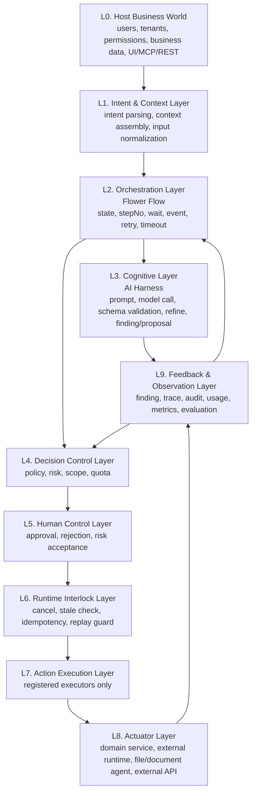
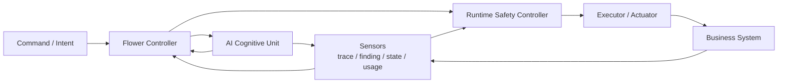
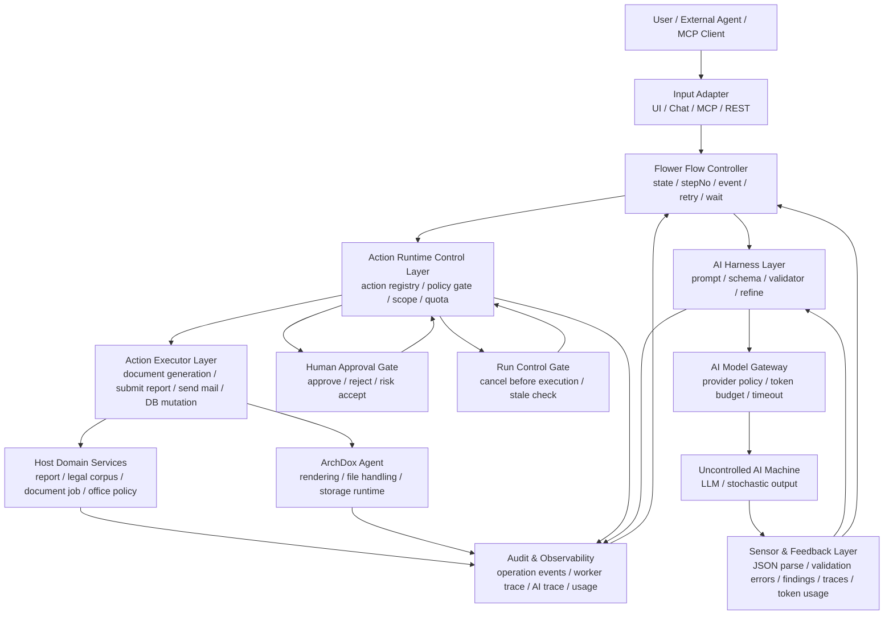
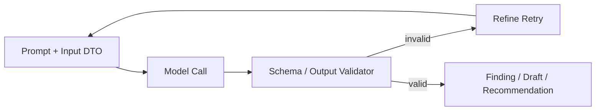
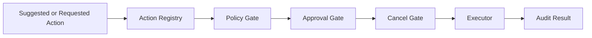
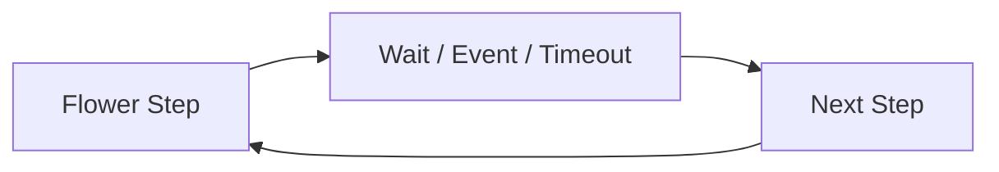
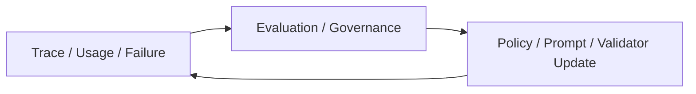
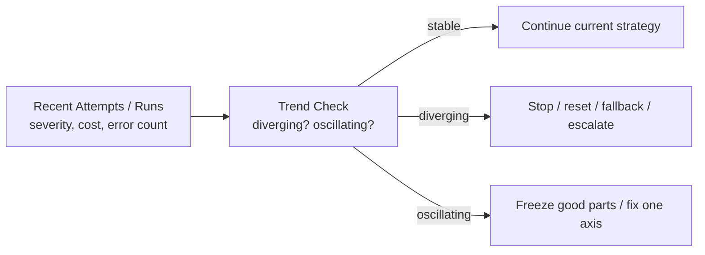
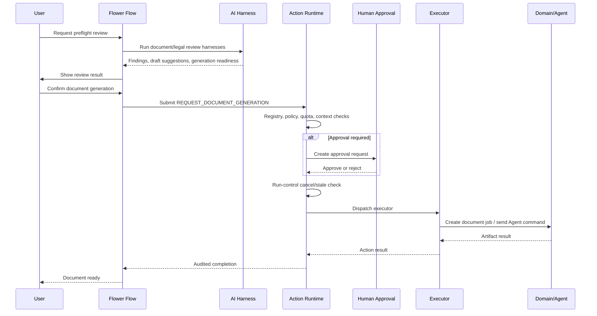

# Flower Action Runtime - AI Machine Control Concept

Status: concept document.

This document records the control philosophy for a future
`flower-action-runtime`. It is not an implementation contract yet. ArchDox is the
validation host. Only patterns that survive real ArchDox workflows should be
extracted into the shared runtime.

## Core Idea

An AI model is treated as an uncertain machine: a piece of equipment with
useful capability but non-deterministic, drift-prone, context-sensitive
behavior. Like any uncertain machine, it must not be run open-loop. It is wrapped
with control layers until the whole system behaves like a controllable business
machine.

The goal of `flower-action-runtime` is not to make the model "trusted". The goal
is to wrap the model and its proposed actions with enough control layers that
the whole system behaves like a controllable business machine.

The AI keeps one consistent role in this model:

```text
AI is an uncertain machine inside the control loop, not the final controller
and not the actuator.
```

In control terms, the AI is an uncertified estimator/proposer stage. Its output
is a measured/estimated signal — a proposal — not an actuator command. The
proposal must pass through the control and safety layers before any side effect
occurs. The side-effect actuator is the executor/domain service, never the model
itself.

The AI may propose, summarize, classify, draft, or recommend. It must not own
business authority, final approval, durable domain state, or direct execution of
side effects.

## Machine Analogy

In equipment control, an uncertain machine does not simply run because someone
asks it to run. A servo motor, for example, is surrounded by drivers, sensors,
controllers, interlocks, and operator panels before it is allowed to move a
load.

The same idea applies to AI. The mapped property is not "AI is exactly a servo
motor". The mapped property is "AI is an uncertain machine that must not run
open-loop, so it is enclosed by the same kind of control hardware around it".

| Equipment Control | AI Runtime Control |
| --- | --- |
| Uncertain machine (e.g. servo motor) | LLM / AI model |
| Servo drive | AI harness |
| MCU / control loop | Flower flow |
| Sensor feedback | schema validation, findings, traces, token usage |
| Safety relay / interlock | policy gate, approval gate, cancel gate |
| Actuator mechanism | executor / domain service / ArchDox Agent |
| HMI | user UI, admin UI, approval screen |
| Maintenance log | audit log, trace event, usage event |

Note: the machine analogy maps capability and uncertainty, not the exact
classical control role. The AI is the uncertain machine that is wrapped; the
component that actually delivers a side effect to the business "load" is the
executor/domain service (the actuator mechanism), not the model.

## Layered Abstract Model

The runtime should be understood as layers, not as a web of arbitrary calls.



Layer meaning:

| Layer | Name | Meaning |
| --- | --- | --- |
| L0 | Host Business World | The real product domain: users, tenants, business records, files, external clients, UI, REST, MCP. |
| L1 | Intent & Context | Converts a request into normalized intent and explicit context. |
| L2 | Orchestration | Flower controls workflow state, steps, waiting, events, retries, timeouts, and recovery. |
| L3 | Cognitive | AI harnesses produce judgments, drafts, classifications, findings, or action proposals. |
| L4 | Decision Control | Policy, permission, scope, quota, and risk checks decide whether execution is allowed to proceed. |
| L5 | Human Control | Durable human approval, rejection, and risk acceptance. AI output is not approval. |
| L6 | Runtime Interlock | Last-moment safety: cancellation, stale request checks, idempotency, and replay protection. |
| L7 | Action Execution | Only registered executors can perform controlled actions. No arbitrary tool/function execution. |
| L8 | Actuator | The side-effect layer: domain services, document/file runtimes, external APIs, device agents. |
| L9 | Feedback | Findings, traces, audit logs, usage, metrics, and evaluation results feed future control decisions. |

Important boundary:

```text
AI Harnesses must stay in L3.
They may propose, but they must not directly cross into L7/L8 execution.
```

Routing note: L3 has no direct edge to L4. The cognitive output reaches the
decision/execution path only through L9 (sensed as a finding/proposal) and L2
(the controller decides whether to submit it as an action request). This is the
structural enforcement of "AI proposes but does not command": the model output
is treated as a measurement, not an actuator command.

L4, L5, and L6 are three protection layers separated mainly by time:

```text
L4 policy     = start-permissive: "may this be requested at all, now, here?"
L5 human      = manual-mode confirmation by an authorized human.
L6 interlock  = trip-point check at the moment of execution: still fresh,
                not cancelled, not a replay, idempotent.
```

This mirrors permissive vs interlock logic in equipment control: a permissive
is checked at the start command, an interlock is checked again at the instant
power is applied.

The ten layers describe the maximum control envelope for a high-risk action.
They are applied conditionally by `effectType`/`riskLevel`, not all at once for
every call:

```text
READ / RECOMMEND / DRAFT
  -> L4 passes trivially, L5 and L6 are skipped (short path).

WRITE / EXTERNAL_SEND / FINANCIAL / PRODUCTION_CHANGE
  -> full path through L4, L5 (when required), and L6.
```

So the layer count is not "overhead on every action". Low-risk actions collapse
to a short path; only high-consequence actions pay for the full envelope.

The abstract control form is:



The cognitive unit is sensed too, not only the plant. The AI output is first
measured by schema validation and finding extraction (the harness validator
acts as the sensor on the cognitive stage) before the controller is allowed to
treat it as a usable proposal. An unsensed model output is never a command.

In this model:

| Control Term | Runtime Term |
| --- | --- |
| Controller | Flower flow and state machine |
| Cognitive unit | AI harness |
| Safety controller | Agent runtime policy/approval/interlock layer |
| Actuator | Action executor and host domain service |
| Plant | Business system being changed |
| Sensor | Trace, finding, state, usage, and evaluation feedback |

`flower-action-runtime` should therefore not be a graph engine and not an AI
harness. It should be the safety-controlled action runtime that turns AI,
user, or system proposals into permissioned, auditable, interruptible
execution.

```text
AI is not connected directly to work.
AI is enclosed inside a controllable action machine.
```

Likely generic runtime concepts:

- `Intent`
- `ActionProposal`
- `ActionRequest`
- `ActionDefinition`
- `ActionRegistry`
- `PolicyDecision`
- `ApprovalDecision`
- `RuntimeInterlock`
- `ActionExecutor`
- `ActionResult`
- `ActionTrace`

## Layered Architecture



## Responsibilities

### Flower Flow

Flower owns orchestration and control state.

It answers:

- What step is the workflow in?
- Should the workflow wait, retry, finish, or fail?
- Which state/event/result moves the flow to the next step?
- Has the flow timed out?

Flower should not own tenant policy, office permissions, prompt logic, or domain
business rules. Durable business state belongs to the host application database.

Long waits must be modeled as control states, not blocking sleeps.

```text
submit work
-> move to waiting step
-> observe event/result/state
-> continue
```

### AI Harness

AI harnesses turn an uncontrolled model call into a controlled AI operation.

They own:

- input DTO
- prompt builder
- prompt version
- model selection defaults
- output schema
- output validator
- refine/retry policy
- finding extraction
- trace hooks

They do not execute domain actions. A harness may produce:

- finding
- draft
- recommendation
- suggested action
- confidence
- limitation

But the harness must not directly mutate business data, generate documents,
send mail, or approve itself.

### Action Runtime

Action Runtime is the action execution boundary.

It owns:

- action registry
- action definition metadata
- policy gate
- scope and permission checks
- quota/rate checks
- approval gate
- run-control/cancel gate
- executor dispatch
- audit trace

Only registered actions may execute. Unknown actions are rejected before policy.

AI output may suggest an action, but execution starts only when a host flow or
service submits an action request to the runtime.

### Human Approval

Human approval is runtime state, not AI output.

AI may say that approval is recommended. That statement has no authority by
itself. Approval is valid only when the host application records an approval
decision from an authorized human.

Typical action lifecycle:

```text
REQUEST_RECEIVED
POLICY_ALLOWED
APPROVAL_REQUIRED
PENDING_APPROVAL
APPROVED
ACTION_STARTED
ACTION_SUCCEEDED
```

or:

```text
REQUEST_RECEIVED
POLICY_ALLOWED
APPROVAL_REQUIRED
PENDING_APPROVAL
REJECTED
ACTION_CANCELLED
```

### Executor

Executors are the actual actuators.

They perform real work such as:

- request document generation
- submit a report
- update a report step
- send a notification
- call a domain service
- call an external execution runtime

Executors must be small, auditable, and attached to explicit action definitions.
They must not hide policy decisions inside execution code.

When an executor needs long-running AI, external I/O, or child flows, it should
use an async action contract so the worker lane can observe completion instead
of blocking inside the executor.

### Host Application

The host application owns domain-specific truth.

In ArchDox, this includes:

- office and user permissions
- report state
- legal corpus
- supervision catalog
- document jobs
- photo and evidence policy
- billing and quotas
- UI approval screens

These are not generic runtime concepts and should not be forced into
`flower-action-runtime`.

## Sensors And Setpoints

A control loop has two inputs that are easy to confuse: the setpoint (what the
system wants) and the sensor measurement (what is actually happening). They must
stay separate, because the controller acts on the difference between them:

```text
error = setpoint (goal) − measured/estimated state
```

The goal is the setpoint, not a sensor. The current state is the plant output;
the sensor is the mechanism that reads that state into a usable signal. Keeping
"goal", "state", and "the device that measures state" distinct is what makes the
error signal well-defined.

This runtime has two different sensor families, sitting at two points in the
loop:

| Family | Measures | Answers | Loop role |
| --- | --- | --- | --- |
| State sensor | the actual current state of the plant | "what is the state now?" | classic feedback measurement of `y` |
| Evaluation sensor | how far a proposed action or realized outcome is from the goal/constraints | "how wrong is this?" | produces the typed error `e` |

Two sensor families are needed because the AI does not emit a scalar. It emits a
structured proposal, and a single measurement cannot say whether that proposal
is good. State sensors establish the world; evaluation sensors score proposals
and outcomes against the goal.

```text
The AI is not a sensor. It is the controller/estimator that, given measured
state plus goal, proposes a control action.
```

The one exception: when the AI forecasts future state (ETA, congestion,
completion time), it acts as a soft sensor — an estimator that emits a predicted
measurement. A soft sensor is uncertain by construction and must be validated
against a hard state sensor before it is trusted. The AI is never the
ground-truth sensor.

Worked example, port-operation runtime (TOS):

| Control element | Port TOS + agent |
| --- | --- |
| Setpoint (goal) | vessel ETD targets, yard utilization limits, priority SLAs |
| Plant | physical terminal: berths, yard, QC/RTG/YT, containers, vessels |
| Plant state `y` | actual berth occupancy, real container positions, equipment status |
| State sensor | TOS data layer + PLC / GPS / gate OCR / vessel AIS telemetry |
| Evaluation sensor | BerthDuplicate, YardBlocking, PriorityInversion, TravelCost, PlanFeasibility |
| Comparator | goal vs measured/predicted state → typed error |
| Controller | agent (proposes plan) + Flower/policy (gates, supervises) |
| Actuator | executor issuing TOS commands: assign berth, dispatch YT, move RTG |
| Soft sensor | the agent's own ETA / congestion / completion forecast |

Domain detectors define what counts as an error; the runtime defines how the
error is handled. The host owns sensors; the runtime owns the loop.

Sensor trust is the foundation everything else stands on:

```text
You control what you measure.
A miscalibrated sensor makes the loop optimize the wrong thing, precisely.
```

So soft/evaluation sensors must be periodically checked against human
ground truth, and each control sample should mark whether a signal is a hard
measurement (schema valid, field present, berth occupied) or a model estimate
(quality score, feasibility guess). Tuning on an unmarked, unchecked estimate is
aiming at a moving target.

## Control Loops

Every loop below shares the same control primitive: a comparator. A sensor
turns an observation (schema error, finding, policy violation, usage overrun)
into a typed error signal, and a controller chooses the next action from that
error. Without an explicit typed error, there is no feedback control, only
logging.

The loops also run at different speeds. They should not be imagined as one fast
servo loop:

```text
fast loop   = deterministic checks: schema, policy, permission, budget.
medium loop = bounded LLM refine/retry for work that can wait.
slow loop   = accumulated correction and trend monitoring across runs.
```

The loops map to the P/I/D-like feedback model described in
[LLM_FEEDBACK_CONTROL_LOOP.md](LLM_FEEDBACK_CONTROL_LOOP.md):

```text
Loop 1 (AI Inner Loop)            ~ P-like: correct the current output.
Loop 4 (Operations Feedback Loop) ~ I-like: correct repeated, accumulated bias.
Loop 5 (Stability Loop)           ~ D-like: damp worsening or oscillating runs.
```

This is PID-inspired, not a PID loop. What transfers is the error taxonomy —
treat present error, accumulated error, and error trend as three separate things
needing three separate responses. What does not transfer is the PID math: there
is no transfer function, no stability margin, no Ziegler-Nichols tuning, because
the AI plant is nonlinear, stochastic, and discrete. The three terms here also
run on different time scales, different stores, and different actuators, and are
not summed. So this is closer to a three-horizon error-memory supervisory
controller than to a classical PID controller.

Two practical consequences:

```text
1. The most valuable term is I: a systematic model bias is a steady-state
   offset, and a persistent correction (prompt constraint, validator, policy)
   is the only thing that removes it. Test I first.

2. The default shape is PI plus a hard interlock, not full PID. Like most
   industrial loops, drop literal D for most actions: replace it with a
   divergence/oscillation circuit-breaker (Loop 5) and reserve real trend
   control for expensive long agent loops, where D's cost and noise sensitivity
   are worth paying for.
```

### 1. AI Inner Loop



The model is stateless. A retry must include the full required context plus the
validation feedback. Do not rely on the model remembering a previous call.

### 2. Action Control Loop



AI suggestions and user requests both enter the same action boundary. Internal
UI, chat, REST, and MCP must not create parallel execution paths.

### 3. Workflow Loop



Flower controls workflow progress. It should use `stepNo`, events, state
observation, and timeouts instead of blocking a worker thread.

### 4. Operations Feedback Loop



This loop is how the system improves. It does not grant the AI more authority.
It improves the controlled machine around the AI.

### 5. Stability Loop



An uncertain machine can compound its own errors. This loop watches the trend
across recent attempts rather than a single output, and damps the run before it
becomes expensive or unsafe. It is deliberately conservative: one strange
attempt is noise, not a trend, so it acts only after repeated worsening or a
clear oscillation. This is the D-like axis, and without it the inner P-like loop
can overshoot or loop indefinitely.

## End-To-End Example

Document generation after preflight review:



## Extraction Boundary

Likely generic `flower-action-runtime` concepts:

- `ActionDefinition`
- `ActionRegistry`
- `ActionRequest`
- `ActionResult`
- `PolicyGate`
- `ApprovalGate`
- `RunControlGate`
- `ActionExecutor`
- `ActionTraceEvent`
- async action execution contract

Host-specific concepts that should stay outside:

- office membership and role model
- report revision rules
- legal corpus ownership
- supervision catalog semantics
- document template details
- billing plans and product packaging
- UI screens and wording

## Non-Negotiable Rules

1. AI does not execute controlled actions directly.
2. AI output is not approval.
3. Unknown actions are rejected before policy.
4. All side-effect actions pass through registry, policy, approval/cancel gates,
   executor dispatch, and audit.
5. Internal SaaS, chat, REST, and MCP use the same action boundary.
6. Long-running work should be async-observed by Flower, not hidden behind
   blocking worker sleeps.
7. Durable business state stays in the host application.
8. The shared runtime should extract only proven patterns, not ArchDox domain
   policy.
9. The AI is a controlled component, never the sensor of record and never the
   final controller. Its forecasts are soft-sensor estimates and must be
   validated against hard state before they are trusted.
10. The goal is a setpoint, not a measurement. Control acts on the error between
    goal and sensed state, so soft sensors must be calibrated against ground
    truth or the loop optimizes the wrong thing precisely.

## Summary

`flower-action-runtime` should make AI usable as part of a controllable machine.

```text
LLM
+ Harness Drive
+ Flower State Controller
+ Action Runtime Safety Controller
+ Domain Executor
+ Feedback/Audit Sensors
= Controlled AI Machine
```

The point is not to make the AI always correct. The point is to make AI-powered
workflows observable, interruptible, permissioned, auditable, and safe to
improve.
